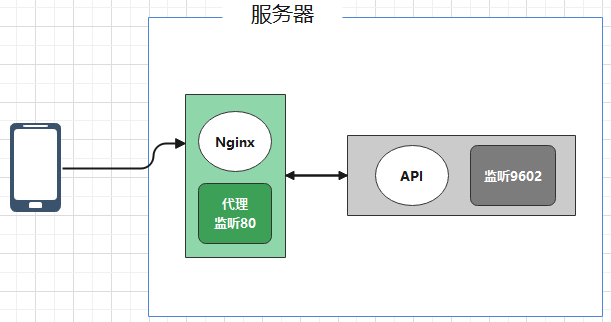

# 线上密码管理系统

## 1. 工程介绍

* 基于 uni-app 实现的“在线密码管理工具”前端工程
* **PC端Web详细使用请见** [**操作手册**](https://github.com/enqiangjing/password-online-web/blob/main/options.md)
* **Android详细使用请见** [**操作手册**](https://github.com/enqiangjing/password-online-web-uniapp/blob/main/options.md)

```shell
# 项目介绍
https://github.com/enqiangjing/password-online

# 前端项目
https://github.com/enqiangjing/password-online-web
https://github.com/enqiangjing/password-online-uniapp

# 后端项目
https://github.com/enqiangjing/password-online-api
```


## 2. 软件架构

### 2.1 服务能力




## 3. 安装教程

### 3.1 获取

``` shell
# 下载 HbuilderX 并导入工程
git clone git@github.com:enqiangjing/password-online-uniapp.git
```
### 3.2 其他
``` shell
# 生成 Android 证书，打包 apk 时使用
keytool -genkey -alias [别名] -keyalg RSA -keysize 2048 -validity 36500 -keystore [证书名称]
# 例如
keytool -genkey -alias aboutsite -keyalg RSA -keysize 2048 -validity 36500 -keystore testsite.keystore
```


## 版本信息

### 最新版本

>* 测试版 v1.0.0 --- 2021-05-19
>    - 修改部分内容展示
>    - 变更密钥文件加载方式
>    - 登录超时后，自动重新登录


## * 免责声明
* 本项目所有内容仅供参考和学习交流使用。
* 项目所存在的风险将由使用者自行承担，因使用本项目而产生的一切后果也由使用者自己承担。
* 凡以任何方式直接、间接使用本项目的人员，视为自愿接受本项目声明和法律法规的约束。
