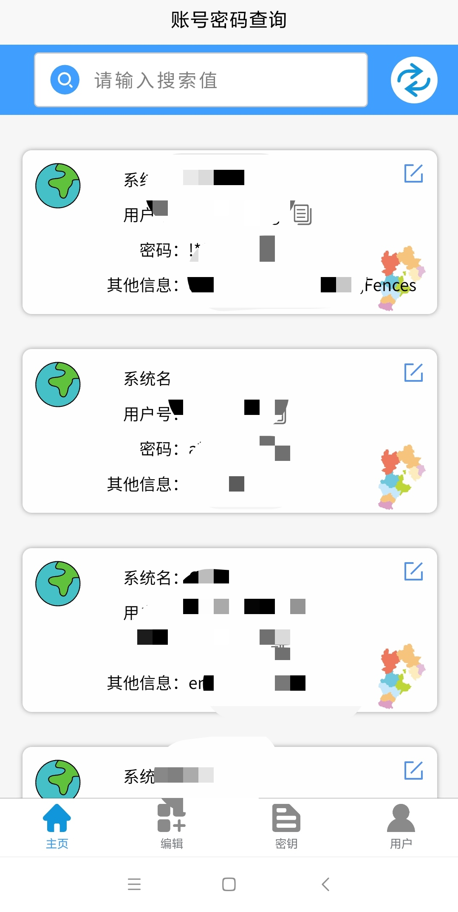
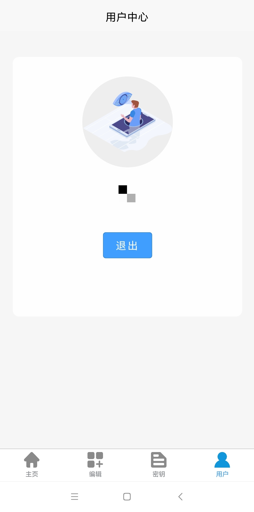
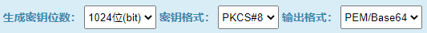
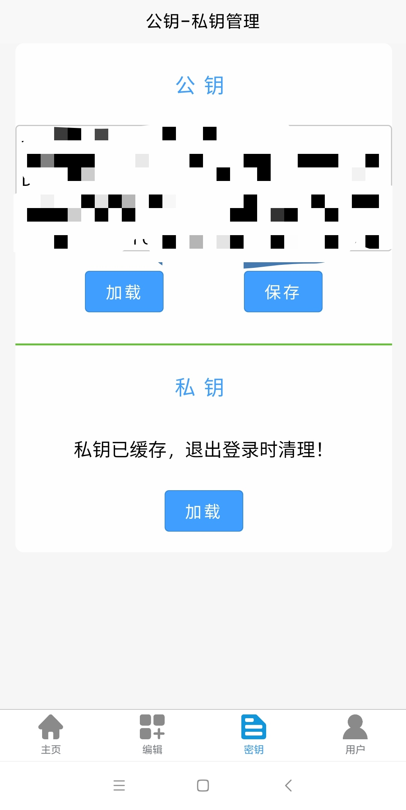
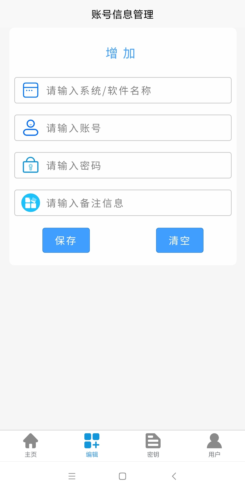

# 操作手册

## 主页

* 打开应用后进入首页，若未登录则会跳转到用户页

## 登录

* 输入用户名及密码登录
* 登录后，仅显示退出按钮
* 退出按钮点击后，会清理缓存的密钥及用户数据等。

## 密钥

* 若未加载公钥和私钥，操作时会自动跳转到该页面
* 选择公钥（必做），保存（可选）---将公钥保存到服务器
* 加载私钥（必做）
* 公钥、私钥加载后，均缓存在本地，可通过“退出”操作清除
* 可使用搜索引擎搜索rsa密钥生成工具，或使用 ./about/data/ 下提供的测试数据
* > 密钥生成方式：  

     > 

## 账号信息增加/修改

* 经公钥加密后发送到密码中心

## 账号查看

* 进入 主页
* 从密码中心获取账号列表，经本地私钥解密后展示
* 搜索功能为本地搜索
